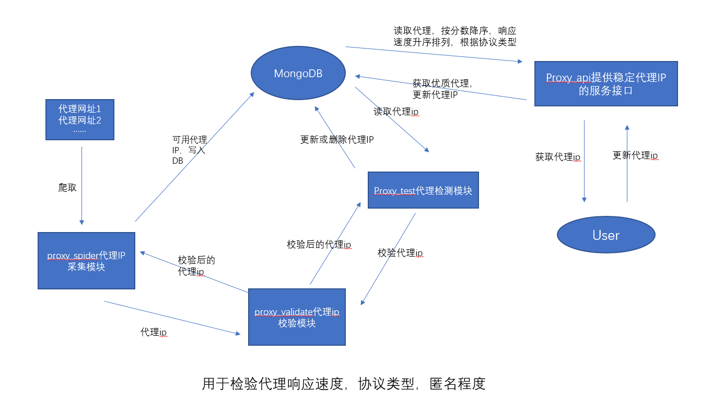
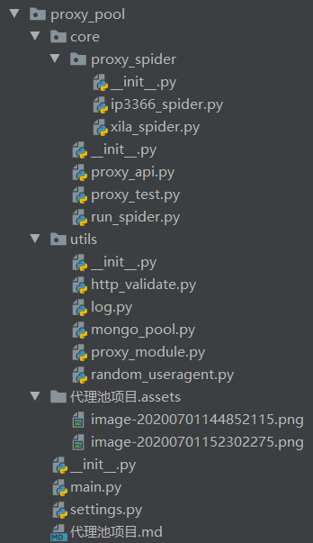

##代理池项目

### 1、代理池的概述

##### 1.1什么是代理池

* 代理池是由代理IP组成的池子，它可以提供多个稳定可用的代理IP

##### 1.2为什么要实现代理词

* 应付ipfanpa
* 免费代理是不稳定的，提高使用效率
* 部分收费代理也不稳定，提高使用效率

##### 1.3代理池开发环境

* 平台：window+linux
* 开发语言：python
* 开发工具：pycharm
* 技术栈：
  * requests、urllib：发送请求，解析url和获取页面数据
  * pymongo:把提取到的代理IP存储到MongoDB数据库中和从MongoDB数据库中读取代理IP，给爬虫使用
  * Django：用于提供web服务

### 2、代理池的设计

#####  2.1代理池的工作流程


* 代理池的工作流程

  

* 代理池工作流程文字描述

  * 代理IP采集模块 ->采集代理IP -> 检测代理IP -> 如果不可用，直接过滤掉，如果可用，指定默认分数 -> 存入数据库中
  * 代理IP检测模块 -> 从数据库中获取所有代理IP -> 检测代理IP -> 如果代理IP不可用，就把分数-1，如果分数为0则会将其从数据库中删除，如果代理ip可用，恢复默认分数值，更新到数据库
  * 代理API模块 -> 从数据库中提取高可用的代理IP给爬虫使用

##### 2.2代理池的模块及其作用

* 代理池分为五大核心模块
  * 爬虫模块：采集代理IP
    * 从代理IP网站上采集代理IP
    * 进行校验（获取代理响应速度，协议类型，匿名类型）
    * 把可用代理ip存储到数据库中
  * 代理ip的校验模块：获取指定代理的响应速度，支持的协议以及匿名程度
    * 原因：网站上所标注的响应速度，协议类型和匿名类型是不准确的
    * 使用httpbin.org进行检测
  * 数据库模块：实现对代理ip的增删改查操作
    * 使用MongoDB来存储代理IP
  * 检测模块：定时的对代理池中的代理进行检测，保证代理池中代理的可用性
    * 从数据库中读取所有的代理ip
    * 对代理IP进行逐一检测，可开启多个协程，以提高检测速度
    * 如果该代理不可用，就让这个代理分数-1,当代理的分数到0了，就删除该代理，如果检测到代理可用就恢复为满分
  * 代理IP服务接口：提供高可用的代理IP给爬虫使用
    * 根据协议类型和域名获取随机的高质量代理IP
    * 根据协议类型和域名获取多个高质量代理IP
    * 根据代理IP，不可用域名，告诉代理池这个代理IP在该域名下不可用，下次获取这个域名的代理IP时候，就不会再获取这个代理IP了，从而保证代理IP高可用性
* 代理池的其他模块：
  * 数据模型：domain.py
    * 代理IP的数据模型，用于封装代理IP相关信息，比如IP，端口号，响应速度，协议类型，匿名程度，分数等。
  * 程序启动入口：main.py
    * 代理池提供一个统一的启动入口
  * 工具模块
    * 日志模块：用于记录日志信息
    * http模块：用于获取随机User-Agent的请求头
  * 配置文件：settings.py
    * 用于默认代理的分数，配置日志格式，文件，启动的爬虫，检验的间隔时间等

##### 2.3代理池的项目结构



* 说明
  * proxy_pool为项目根目录
    * core为功能目录
      * proxy_spider目录为具体爬虫目录，单个爬虫实现了通用的接口
      * run_spider.py文件，为爬虫运行模块，实现所有爬虫的运行
      * proxy_test.py文件，为代理检测模块，负责从mongodb中读取文件，进行检验
      * proxy_api.py文件，通过flask，实现网页通用api
    * utils为工具目录
      * http_validate.py文件，负责检验proxy的可用性
      * log.py文件，负责文件日志记录和控制台输出
      * mongo_pool.py文件，数据库模块，实现增删改查
      * proxy_module.py文件，proxy的模型文件，定义关键字
      * random_useragent.py文件，负责提供随机的user-agent
    * main.py为项目运行入口，实现了各个模块之间的串连
    * settings.py为项目配置文件
    * .md文件 为说明文件
    * .assets目录 为.md文件的图片存放目录

### 3、实现代理的思路

* 思路1：
  * 依据项目的设计的流程图，一步一步进行实现
  * 遇到需要依赖于其他模块的地方，就暂停当前的模块，去实现其他模块中需要使用的功能
  * 其他模块实现后，再回来接着写当前模块
* 思路2：
  * 先实现基础模块，这些模块不依赖于其他的模块，如：数据模型，校验模块，数据库模块
  * 然后实现具体的功能模块，如爬虫模块，检测模块，代理API模块

### 4、实现代理IP模型类

* 目标：定义代理IP的数据模型类

* 步骤：

  * 定义Proxy类，继承object
  * 实现`__init__`方法，负责初始化，包括字段：
    * ip：代理的IP地址
    * port：代理IP的端口号
    * protocol：代理IP支持的协议类型：http是0，https是1，http&https是2
    * nick_type：代理IP的匿名程度，高匿:0，匿名:1，透明:2
    * speed：代理IP的响应速度，单位s
    * area：代理IP所在地区
    * score：代理IP的评分，用于衡量代理的可用性，默认分数可以通过配置文件进行配置，在进行代理可用性检查时，没遇到一次请求失败就减去1，减到0时则从池中删除，如果检查代理可用，就恢CO复默认分值
    * disable_domains:不可用域名列表，有些代理IP在某些域名下不可用，但是在其他域名下可用
  * 在配置文件：settings.py中定义MAX_SCORE=50，代表代理IP的默认最高分数
  * 提供`__str__`方法，返回数据字符串

* 代码

  ```python
  """
  模型类，定义关键字
  """
  from .settings import MAX_SCORE
  
  
  class Proxy(object):
      def __init__(self, ip, port, protocol=-1, nick_type=-1, speed=-1, area=None, score=MAX_SCORE):
          self.ip = ip
          self.port = port
          self.protocol = protocol
          self.nick_type = nick_type
          self.speed = speed
          self.area = area
          self.score = score
  
      def __str__(self):
          return str(self.__dict__)
  ```

### 5、实现代理IP的工具模块

##### 5.1 日志模块

* 实现日志模块的目的

  * 能够方便的对程序进行调试
  * 能够方便记录程序的运行状态
  * 能够方便记录错误信息

* 日志的实现

  * 拷贝网络中的日志代码，根据自己的项目进行修改

  * 整体代码

    ```python
    import sys
    import logging
    
    # 默认的配置
    LOG_LEVEL = logging.INFO  # 默认等级
    LOG_FMT = '%(asctime)s %(filename)s [line:%(lineno)d] %(levelname)s: %(message)s'  # 默认格式
    LOG_DATEFMT = '%Y-%m-%d %H:%M:%S'  # 默认时间格式
    LOG_FILENAME = 'log.log'  # 默认日志文件名称
    
    
    class Logger(object):
    
        def __init__(self):
            # 获取一个logger对象
            self._logger = logging.getLogger()
            # 设置format对象
            self.formatter = logging.Formatter(fmt=LOG_FMT, datefmt=LOG_DATEFMT)
            # 设置日志输出
            # -设置文件日志模式
            self._logger.addHandler(self._get_file_handler(LOG_FILENAME))
            # -设置终端日志模式
            self._logger.addHandler(self._get_console_handler())
            # 设置日志等级
            self._logger.setLevel(LOG_LEVEL)
    
        def _get_file_handler(self, filename):
            """返回一个文件日志handler"""
            file_handler = logging.FileHandler(filename=filename, encoding='utf8')
            file_handler.setFormatter(self.formatter)
            return file_handler
    
        def _get_console_handler(self):
            console_handler = logging.StreamHandler(sys.stdout)
            console_handler.setFormatter(self.formatter)
            return console_handler
    
        @property
        def logger(self):
            return self._logger
    
    
    # 初始化并配置一个logger对象，使用时直接导入logger可以使用了
    logger = Logger().logger
    
    if __name__ == '__main__':
        logger.debug('调试信息')
        logger.info('状态信息')
        logger.warning('警告信息')
        logger.error('错误信息')
        logger.critical('严重错误信息')
    
    ```

  

##### 5.2 http模块

* 提供随机的User-Agent请求头

  ```python
  USER_AGENTS = [
      "Mozilla/5.0 (Linux; U; Android 2.3.6; en-us; Nexus S Build/GRK39F) AppleWebKit/533.1 (KHTML, like Gecko) Version/4.0 Mobile Safari/533.1",
      "Avant Browser/1.2.789rel1 (http://www.avantbrowser.com)",
      "Mozilla/5.0 (Windows; U; Windows NT 6.1; en-US) AppleWebKit/532.5 (KHTML, like Gecko) Chrome/4.0.249.0 Safari/532.5",
      "Mozilla/5.0 (Windows; U; Windows NT 5.2; en-US) AppleWebKit/532.9 (KHTML, like Gecko) Chrome/5.0.310.0 Safari/532.9",
      "Mozilla/5.0 (Windows; U; Windows NT 5.1; en-US) AppleWebKit/534.7 (KHTML, like Gecko) Chrome/7.0.514.0 Safari/534.7",
      "Mozilla/5.0 (Windows; U; Windows NT 6.0; en-US) AppleWebKit/534.14 (KHTML, like Gecko) Chrome/9.0.601.0 Safari/534.14",
      "Mozilla/5.0 (Windows; U; Windows NT 6.1; en-US) AppleWebKit/534.14 (KHTML, like Gecko) Chrome/10.0.601.0 Safari/534.14",
      "Mozilla/5.0 (Windows; U; Windows NT 6.1; en-US) AppleWebKit/534.20 (KHTML, like Gecko) Chrome/11.0.672.2 Safari/534.20",
      "Mozilla/5.0 (Windows NT 6.1; WOW64) AppleWebKit/534.27 (KHTML, like Gecko) Chrome/12.0.712.0 Safari/534.27",
      "Mozilla/5.0 (Windows NT 6.1; WOW64) AppleWebKit/535.1 (KHTML, like Gecko) Chrome/13.0.782.24 Safari/535.1",
      "Mozilla/5.0 (Windows NT 6.0) AppleWebKit/535.2 (KHTML, like Gecko) Chrome/15.0.874.120 Safari/535.2",
      "Mozilla/5.0 (Windows NT 6.1; WOW64) AppleWebKit/535.7 (KHTML, like Gecko) Chrome/16.0.912.36 Safari/535.7",
      "Mozilla/5.0 (Windows; U; Windows NT 6.0 x64; en-US; rv:1.9pre) Gecko/2008072421 Minefield/3.0.2pre",
      "Mozilla/5.0 (Windows; U; Windows NT 5.1; en-US; rv:1.9.0.10) Gecko/2009042316 Firefox/3.0.10",
      "Mozilla/5.0 (Windows; U; Windows NT 6.0; en-GB; rv:1.9.0.11) Gecko/2009060215 Firefox/3.0.11 (.NET CLR 3.5.30729)",
      "Mozilla/5.0 (Windows; U; Windows NT 6.0; en-US; rv:1.9.1.6) Gecko/20091201 Firefox/3.5.6 GTB5",
      "Mozilla/5.0 (Windows; U; Windows NT 5.1; tr; rv:1.9.2.8) Gecko/20100722 Firefox/3.6.8 ( .NET CLR 3.5.30729; .NET4.0E)",
      "Mozilla/5.0 (Windows NT 6.1; rv:2.0.1) Gecko/20100101 Firefox/4.0.1",
      "Mozilla/5.0 (Windows NT 6.1; Win64; x64; rv:2.0.1) Gecko/20100101 Firefox/4.0.1",
      "Mozilla/5.0 (Windows NT 5.1; rv:5.0) Gecko/20100101 Firefox/5.0",
      "Mozilla/5.0 (Windows NT 6.1; WOW64; rv:6.0a2) Gecko/20110622 Firefox/6.0a2",
      "Mozilla/5.0 (Windows NT 6.1; WOW64; rv:7.0.1) Gecko/20100101 Firefox/7.0.1",
      "Mozilla/5.0 (Windows NT 6.1; WOW64; rv:2.0b4pre) Gecko/20100815 Minefield/4.0b4pre",
      "Mozilla/4.0 (compatible; MSIE 5.5; Windows NT 5.0 )",
      "Mozilla/4.0 (compatible; MSIE 5.5; Windows 98; Win 9x 4.90)",
      "Mozilla/5.0 (Windows; U; Windows XP) Gecko MultiZilla/1.6.1.0a",
      "Mozilla/2.02E (Win95; U)",
      "Mozilla/3.01Gold (Win95; I)",
      "Mozilla/4.8 [en] (Windows NT 5.1; U)",
      "Mozilla/5.0 (Windows; U; Win98; en-US; rv:1.4) Gecko Netscape/7.1 (ax)",
      "Mozilla/5.0 (hp-tablet; Linux; hpwOS/3.0.2; U; de-DE) AppleWebKit/534.6 (KHTML, like Gecko) wOSBrowser/234.40.1 Safari/534.6 TouchPad/1.0",
  ]
  ```

  

### 6、实现代理IP的校验模块

* 目的：检查代理IP速度，匿名程度以及支持的协议类型

* 步骤：

  * 检查代理ip速度和匿名程度

    * 代理ip速度：从发送请求到获取响应的时间间隔

    * 匿名程度检查

      * 对`http(https)://httpbin.org/get`发送请求

      * 如果响应的`origin`中有由`,`分割的两个IP就是透明代理IP

      * 如果响应的`headers`中包含``Proxy-Connection说明是匿名代理IP

      * 否则就是高匿代理IP

        ```python
        {
          "args": {}, 
          "headers": {
            "Accept": "text/html,application/xhtml+xml,application/xml;q=0.9,image/webp,image/apng,*/*;q=0.8,application/signed-exchange;v=b3;q=0.9", 
            "Accept-Encoding": "gzip, deflate", 
            "Accept-Language": "zh-CN,zh;q=0.9", 
            "Host": "httpbin.org", 
            "Upgrade-Insecure-Requests": "1", 
            "User-Agent": "Mozilla/5.0 (Windows NT 10.0; Win64; x64) AppleWebKit/537.36 (KHTML, like Gecko) Chrome/83.0.4103.116 Safari/537.36", 
            "X-Amzn-Trace-Id": "Root=1-5efc5633-ad2cb41439edaca07204ed84"
          }, 
          "origin": "171.42.143.174", 
          "url": "http://httpbin.org/get"
        }
        ```

        

  * 检查代理IP协议类型

    * 如果`http://httpbin.org/get`发送请求成功，说明支持http协议
    * 如果`https://httpbin.org/get`发送请求成功，说明支持https协议

* ```python
  import requests
  import json
  import time
  from work_project.IpProxyPool.utils.http import RandomUserAgent
  from work_project.IpProxyPool import settings
  from work_project.IpProxyPool.utils.log import logger
  from work_project.IpProxyPool.domain import Proxy
  
  
  def _check_http_proxies(proxies=None, is_http=True):
      nick_type = -1
      speed = -1
      if is_http:
          test_url = 'http://httpbin.org/get'
      else:
          test_url = 'https://httpbin.org/get'
      # 获取开始时间
      start = time.time()
      # 发送请求
      headers = {
          'User-Agent': "{}".format(RandomUserAgent()),
      }
      try:
          response = requests.get(url=test_url, headers=headers, proxies=proxies, timeout=settings.TIMEOUT)
          if response.ok:
              # 响应速度
              speed = round(time.time() - start, 2)
              dict_ = json.loads(response.content.decode())
              # 获取origin
              origin = dict_.get('origin')
              proxy_connection = dict_.get('headers').get('Proxy-Connection')
              # 判断匿名程度
              if ',' in origin:
                  nick_type = 2  # 2代表透明
              elif proxy_connection:
                  nick_type = 1  # 1代表匿名
              else:
                  nick_type = 0  # 0代表高匿
              return True, nick_type, speed
          return False, nick_type, speed
      except Exception as ex:
          # logger.exception(ex)
          return False, nick_type, speed
  
  
  def check_proxy(proxy):
      """
      用于检查指定 代理ip 响应速度，匿名程度，支持协议类型
      :param proxy: 代理IP模型对象
      :return : 检查后的代理模型对象
      """
      # 准备代理ip
      proxies = {
          "http": "http://{}:{}".format(proxy.ip, proxy.port),
          'https': 'https://{}:{}'.format(proxy.ip, proxy.port)
      }
      # 测试该代理ip
      is_http, http_nick_type, http_speed = _check_http_proxies(proxies=proxies, is_http=True)
      is_https, https_nick_type, https_speed = _check_http_proxies(proxies=proxies, is_http=False)
  
      if is_http and is_https:
          proxy.protocol = 2  # 都支持
          proxy.nick_type = https_nick_type	# 有的是https为高匿，http为透明，默认为https,且支持高匿
          proxy.speed = https_speed
      elif is_http:
          proxy.protocol = 0  # 都支持
          proxy.nick_type = http_nick_type
          proxy.speed = http_speed
      elif is_https:
          proxy.protocol = 1
          proxy.nick_type = https_nick_type
          proxy.speed = https_speed
      else:
          proxy.protocol = -1
          proxy.nick_type = -1
          proxy.speed = -1
  
  
  if __name__ == "__main__":
      proxy = Proxy(ip='95.179.130.230', port=8080)
      check_proxy(proxy)
      print(proxy)
  
  ```

  

### 7、实现数据库模块

* 作用：用于对proxies集合进行数据库的相关操作

* 目标：实现对数据库增删改查相关操作

* 步骤：
  * 1.在`init`中，建立数据连接，获取要操作的集合，在`del`方法中关闭数据库连接
  * 2.提供基础的增删改查功能
    * 实现插入功能
    * 实现修改功能
    * 实现删除代理：根据代理的ip删除代理
    * 查询所有代理ip的功能
  * 3.提供代理API模块使用的功能
    * 实现查询功能，根据条件进行查询，可以指定查询数量，先分数降序，速度升序排，保证优质的代理IP在上面
    * 实现根据协议类型和要访问网站的域名，获取代理IP列表
    * 实现更具协议类型和要访问网站的域名，随机获取一个代理IP
    * 实现把指定域名添加到指定的disable_domain列表中
  
* 代码

  ```python
  from pymongo import MongoClient
  import pymongo
  import random
  from work_project.IpProxyPool.settings import MONGO_URL
  from work_project.IpProxyPool.utils.log import logger
  from work_project.IpProxyPool.domain import Proxy
  
  
  class MongoPool(object):
  
      def __init__(self):
          # 在`init`中，建立数据连接，获取要操作的集合
          self.client = MongoClient(MONGO_URL)
          self.proxies = self.client['proxies_pool']['proxies']
  
      def __del__(self):
          """关闭连接"""
          self.client.close()
  
      def insert_one(self, proxy):
          count_ = self.proxies.count_documents({'_id': proxy.ip})
          if count_ == 0:
              dict_ = proxy.__dict__
              dict_["_id"] = proxy.ip
              self.proxies.insert_one(dict_)
              logger.info('插入新的代理{}'.format(proxy))
          else:
              logger.warning('该代理{}已经存在'.format(proxy.ip))
  
      def update_one(self, proxy):
          self.proxies.update_one({"_id": proxy.ip}, {'$set': proxy.__dict__})
          logger.info("已更新{}".format(proxy))
  
      def delete_one(self, proxy):
          self.proxies.delete_one({'_id': proxy.ip})
          logger.info('已删除{}'.format(proxy))
  
      def find_all(self):
          cursor = self.proxies.find()
          for item in cursor:
              item.pop('_id')
              proxy = Proxy(**item)
              yield proxy
  
      def find_sort(self, conditions=dict(), count=0):
          """
          实现查询功能
          :param conditions: 查询条件
          :param count: 限制最多取出多少个代理IP
          :return : 返回满足要求代理IP(proxy对象)列表
          """
          # sort里面的参数是一个列表，列表中包含元组
          cursor = self.proxies.find(filter=conditions, limit=count).sort([("score", pymongo.DESCENDING), ('speed', pymongo.ASCENDING)])
          proxy_list = []
          for item in cursor:
              item.pop("_id")
              proxy = Proxy(**item)
              proxy_list.append(proxy)
          return proxy_list
  
      def get_proxies(self, protocol=None, domain=None, count=0, nick_type=0):
          """
          实现根据协议类型和要访问网站的域名，获取代理IP列表
          """
          # 定义一个查询条件
          conditions = {'nick_type': nick_type}   # 默认高匿
          if protocol is None:
              # 如果没有指定protocol，返回http&https
              conditions['protocol'] = 2
          elif protocol.lower == 'http':
              conditions['protocol'] = {'$in': [0, 2]}
          else:
              conditions['protocol'] = {'$in': [1, 2]}
          if domain:
              conditions['disable_domain'] = {"$nin": [domain]}
          # 返回满足要求的列表
          return self.find_sort(conditions=conditions, count=count)
  
      def random_proxy(self, protocol=None, domain=None, count=0, nick_type=0):
          proxy_list = self.get_proxies(protocol=protocol, domain=domain, count=count, nick_type=nick_type)
          return random.choice(proxy_list)
  
      def add_disable_domain(self, ip, domain):
          # 将domain传入到指定的ip中
          count = self.proxies.count_documents({'_id': ip, 'disable_domain': domain})
          if count == 0:
              self.proxies.update_one({'_id': ip}, {'$push': {'disable_domain': domain}})
              return True
          return False
  
  
  if __name__ == "__main__":
      mongo = MongoPool()
      # proxy = Proxy(ip='95.179.130.232', port=8888)
      # mongo.insert_one(proxy=proxy)
      # mongo.update_one(proxy)
      # mongo.delete_one(proxy)
      # for item in mongo.find_all():
      #     print(item)
      # mongo.add_disable_domain(ip='95.179.130.230', domain='taobao.com')
      for item in mongo.get_proxies():
          print(item)
  
  ```

  

### 8、实现代理IP爬虫模块

##### 8.1 爬虫模块的需求

* 需求：抓取各个代理IP网站上的免费代理IP,进行检测，如果可用就存储到数据库中
* 主要网站：
  * ip3366代理：http://www.ip3366.net/
    * 国内高匿：http://www.ip3366.net/free/?stype=1
    
    * 国内普通：http://www.ip3366.net/free/?stype=2
    
    * 说明：该代理采用GBK编码
    
    * 代码
    
      ```python
      import requests
      import re
      import random
      import time
      from lxml import etree
      from proxy_pool.utils.random_useragent import RandomUserAgent
      from proxy_pool.utils.proxy_module import Proxy
      
      
      class Ip3366ProxySpider(object):
      
          def __init__(self, first_url):
              self.first_url = first_url
      
          def construct_url(self, first_url):
              url_list = list()
              for num in range(1, 8):
                  url = first_url + "&page=" + str(num)
                  url_list.append(url)
              return url_list
      
          def construct_headers(self, url):
              if url.rsplit('=', 1)[-1] == '1':
                  referer = None
              else:
                  num = int(url.rsplit('=', 1)[-1])
                  referer = re.sub(r'page=\d+', str(num - 1), url)
              headers = {
                  "User-Agent": "{}".format(RandomUserAgent()),
                  "Referer": referer
              }
              return headers
      
          def construct_requests(self, url, headers):
              response = requests.get(url=url, headers=headers)
              time.sleep(random.uniform(0, 1))
              return response
      
          def parse_html(self, html_str):
              html = etree.HTML(html_str)
              proxy = Proxy()
              tr_list = html.xpath('//tbody/tr')
              for tr in tr_list:
                  ip = tr.xpath("./td[1]/text()")
                  ip = ip[0] if ip else None
                  port = tr.xpath('./td[2]/text()')
                  port = port[0] if port else None
                  area = tr.xpath('./td[5]/text()')
                  area = area[0] if area else None
                  proxy = Proxy(ip=ip, port=port, area=area)
                  yield proxy
      
          def run(self):
              url_list = self.construct_url(self.first_url)
              for url in url_list:
                  headers = self.construct_headers(url)
                  response = self.construct_requests(url, headers)
                  if response.ok:
                      proxy_list = self.parse_html(html_str=response.content.decode('GBK'))
                      yield from proxy_list
      
      
      class Ip3366Spider(object):
          def __init__(self):
              self.first_url_list = [
                  "http://www.ip3366.net/free/?stype=1",
                  "http://www.ip3366.net/free/?stype=2",
              ]
      
          def get_proxies(self, first_url):
              proxies = Ip3366ProxySpider(first_url).run()
              yield from proxies
      
          def run(self):
              for first_url in self.first_url_list:
                  try:
                      proxies = self.get_proxies(first_url)
                      yield from proxies
                  except Exception as e:
                      pass
      
      
      if __name__ == "__main__":
          obj = Ip3366Spider()
          for ret in obj.run():
              print(ret)
      
      ```
    
      
    
  * 快代理：https://www.kuaidaili.com/
    * 国内高匿：https://www.kuaidaili.com/free/inha/
    * 国内普通：https://www.kuaidaili.com/free/intr/
    
  * 66ip代理：http://www.66ip.cn/areaindex_34/1.html
    
    * areaindex_（1到34），后面的是页数
    
  * 西拉代理：http://www.xiladaili.com/
    * 高匿代理：http://www.xiladaili.com/gaoni/
    * http代理：http://www.xiladaili.com/http/
    * https代理：http://www.xiladaili.com/https/
    * 普通代理：http://www.xiladaili.com/putong/
    * 代码：
    
    ```python
    import requests
    import time
    import random
    from lxml import etree
    from proxy_pool.utils.random_useragent import RandomUserAgent
    from proxy_pool.utils.proxy_module import Proxy
    
    
    class XiLaProxySpider(object):
        """
        获取该网站，模块的代理，需要输入first_url
        """
    
        def __init__(self, first_url):
            self.first_url = first_url
    
        def construct_url(self, first_url):
            url_list = list()
            for num in range(1, 10):
                url = first_url + str(num)
                url_list.append(url)
            return url_list
    
        def construct_headers(self, url):
            if url.rsplit('/', 1)[-1] == "1":
                referer = None
            else:
                num = int(url.rsplit('/', 1)[-1])
                referer = url.rsplit('/', 1)[0] + "/" + str(num - 1)
            headers = {
                "User-Agent": "{}".format(RandomUserAgent()),
                'Referer': referer
            }
            return headers
    
        def construct_requests(self, url, headers):
            response = requests.get(url=url, headers=headers)
            time.sleep(random.uniform(0, 1))
            return response
    
        def parse_html(self, html_str):
            html = etree.HTML(html_str)
            proxy = Proxy()
            tr_list = html.xpath('//table[contains(@class,"fl-table")]/tbody/tr')
            for tr in tr_list:
                ip_port = tr.xpath('./td[1]/text()')
                ip, port = ip_port[0].split(":") if ip_port else None
                area = tr.xpath('./td[4]/text()')
                area = area[0] if area else None
                proxy = Proxy(ip=ip, port=port, area=area)
                yield proxy
    
        def run(self):
            # 构造请求的url
            url_list = self.construct_url(first_url=self.first_url)
            for url in url_list:
                headers = self.construct_headers(url)
                response = self.construct_requests(url=url, headers=headers)
                if response.ok:
                    proxy_list = self.parse_html(html_str=response.text)
                    yield from proxy_list
    
    
    class XiLaSpider(object):
        def __init__(self):
            self.first_url_list = [
                "http://www.xiladaili.com/gaoni/",
                "http://www.xiladaili.com/http/",
                "http://www.xiladaili.com/https/",
                "http://www.xiladaili.com/putong/"
            ]
    
        def get_proxies(self, first_url):
            proxies = XiLaProxySpider(first_url).run()
            yield from proxies
    
        def run(self):
            for first_url in self.first_url_list:
                try:
                    proxies = self.get_proxies(first_url)
                    yield from proxies
                except Exception as e:
                    pass
    
    
    if __name__ == "__main__":
        obj = XiLaSpider()
        for ret in obj.run():
            print(ret)
        # obj.run()
    
    ```
    
    

##### 8.2 爬虫模块的设计思路

* 通用爬虫：通过指定url列表，分组xpath和组内xpath，来提取不同网站的代理ip
  * 原因：代理ip网站的页面结构几乎都是table，页面结构类似
* 具体爬虫：用于抓取具体代理ip网站
  * 通过继承通用爬虫实现具体网站的抓取，一般只需要指定爬取的url列表，分组的xpath就可以了
  * 如果该网站有特殊反扒手段，可以通过重写某些方法实现反爬
* 爬虫运行模块：启动爬虫，抓取代理ip，进行检测，如果可用，就存储到数据库中
  * 通过配置文件来控制启动哪些爬虫，增加扩展性，如果将来我们遇到返回json格式的代理网站，写一个爬虫配置以下就好了。

##### 8.3 实现通用爬虫

##### 8.4 实现具体爬虫

##### 8.5 实现运行爬虫模块

* 目标：根据配置文件信息， 加载爬虫，抓取代理IP，进行校验，如果可用，写入到数据库中

* 思路：
  * 在中run_spider.py中，创建RunSpider类
  * 提供一个运行爬虫的run方法，作为运行爬虫的入口，实现核心的处理逻辑
    * 根据配置信息，获取爬虫对象列表
    * 遍历爬虫对象列表，获取爬虫对象，遍历爬虫对象的get_proxies方法，获取代理IP
    * 检测代理IP(代理IP检测模块)
    * 如果可用，写入数据库（数据库模块）
    * 处理异常，防止一个爬虫内部出错了，影响其他的爬虫
  * 使用异步来执行每一个爬虫任务，以提高抓取代理IP效率
    * 在`init`方法中创建协程池对象
    * 把处理一个代理爬虫的代码抽到一个方法
    * 使用异步执行这个方法
    * 调用协程的`join`方法，让当前线程等待队列任务的完成
  * 使用`schedule`模块，实现每隔一定的时间，执行一次爬取任务
    * 定义一个`start`的类方法
    * 创建当前类的对象，调用run方法
    * 使用`schedule`模块，每隔一定的时间，执行当前对象的run方法
  
* 步骤：
  * 在run_spider.py中，创建RunSpider类
  * 修改settings.py增加代理ip爬虫的配置信息
  
* settings.py中代码

  ```python
  # 配置run_spider模块
  # ---配置spider
  SPIDER_LIST = {
      "proxy_pool.core.proxy_spider.xila_spider.XiLaSpider",
      "proxy_pool.core.proxy_spider.ip3366_spider.Ip3366Spider",
  }
  # ---配置schedule的周期
  RUN_SPIDER_INTERVAL = 4
  ```

* run_spider代码

  ```python
  from gevent import monkey
  
  monkey.patch_all()
  import importlib
  from gevent.pool import Pool
  from proxy_pool.settings import SPIDER_LIST, RUN_SPIDER_INTERVAL
  from proxy_pool.utils.http_validate import check_proxy
  from proxy_pool.utils.mongo_pool import MongoPool
  from proxy_pool.utils.log import logger
  import schedule
  import time
  
  
  class RunSpider(object):
      def __init__(self):
          self.mongo_pool = MongoPool()
          self.coroutine_pool = Pool()
  
      def get_spider_from_settings(self):
          for class_full_name in SPIDER_LIST:
              module_name, class_name = class_full_name.rsplit('.', 1)
              module = importlib.import_module(module_name)
              spider_class = getattr(module, class_name)
              spider = spider_class()
              yield spider
  
      def process_one_spider(self, spider):
          try:
              for proxy in spider.run():
                  check_proxy(proxy)
                  if proxy.speed != -1:
                      self.mongo_pool.insert_one(proxy)
          except Exception as ex:
              logger.warning(ex)
  
      def run(self):
          spider_list = self.get_spider_from_settings()
          for spider in spider_list:
              self.coroutine_pool.apply_async(func=self.process_one_spider, args=(spider,))
          self.coroutine_pool.join()
  
      @classmethod
      def start(cls):
          rs = cls()
          rs.run()
          schedule.every(RUN_SPIDER_INTERVAL).hours.do(rs.run)
          while True:
              schedule.run_pending()
              time.sleep(1)
  
  
  if __name__ == "__main__":
      RunSpider().run()
  
  ```

  

### 9、实现代理IP检测模块

* 目的：检查代理IP可用性，保证代理池中代理IP基本可用

* 思路：
  * 1.在proxy_test.py中，创建ProxyTester类
  * 2.提供一个`run`方法，用于处理检测代理IP核心逻辑
    * 从数据库中获取所有代理IP
    * 遍历代理IP列表
    * 检查代理IP可用性，
      * 如果代理不可用，让代理分数-1，如果代理分数等于0就从数据库中删除该代理，否则更新该代理
      * 如果代理可用，就恢复该代理的分数，更新到数据库中
  * 3.为了提高检查的速度，使用异步来执行检测任务
    * 把要检测的代理IP，放到队列中
    * 把检查一个代理可用性的代码，抽取到一个方法中，从队列中获取代理IP，进行检查，检查完毕，调度队列的task_done方法
    * 通过异步回调，使用死循环不断执行这个方法
    * 开启多个一个异步任务，来处理代理IP的检测，可以通过配置文件指定异步数量
  * 4.使用`schedule`模块，每隔一定的时间，执行一次检测任务
    * 定义类方法`start`，用于启动检测模块
    * 在`start`方法中
      * 创建本类对象
      * 调用run方法
      * 每隔一定时间，执行以下run方法
  
* 代码

  ```python
  from gevent import monkey
  monkey.patch_all()
  
  from gevent.pool import Pool
  from queue import Queue
  from proxy_pool.utils.mongo_pool import MongoPool
  from proxy_pool.settings import ASYNC_COUNT, DEFAULT_SCORE, TEST_SPIDER_INTERVAL
  from proxy_pool.utils.http_validate import check_proxy
  import schedule
  import time
  
  
  class ProxyTest(object):
      def __init__(self):
          self.mongo_pool = MongoPool()
          self.proxy_queue = Queue()
          self.coroutine_pool = Pool()
  
      def check_one_proxy(self):
          proxy = self.proxy_queue.get()
          check_proxy(proxy)
          if proxy.speed == -1:
              proxy.score -= 1
              if proxy.score == 0:
                  self.mongo_pool.delete_one(proxy)
              self.mongo_pool.update_one(proxy)
          proxy.score = DEFAULT_SCORE
          self.mongo_pool.update_one(proxy)
          self.proxy_queue.task_done()
  
      def check_call_back(self, temp):
          self.coroutine_pool.apply_async(func=self.check_one_proxy, callback=self.check_call_back)
  
      def run(self):
          for proxy in self.mongo_pool.find_all():
              self.proxy_queue.put(proxy)
          for i in range(ASYNC_COUNT):
              self.coroutine_pool.apply_async(func=self.check_one_proxy, callback=self.check_call_back)
          self.coroutine_pool.join()
          self.proxy_queue.join()
  
      @classmethod
      def start(cls):
          rs = cls()
          rs.run()
          schedule.every(TEST_SPIDER_INTERVAL).hours.do(rs.run)
          while True:
              schedule.run_pending()
              time.sleep(1)
  
  if __name__ == "__main__":
      obj = ProxyTest()
      obj.start()
  ```

### 10、实现代理IP池的API模块

* 目标：
  
  * 为爬虫提供高可用代理IP的服务接口
  
* 步骤
  * 实现根据协议类型和域名，提供随机的获取高可用代理IP的服务
  * 实现根据协议类型和域名，提供获取多个高可用代理IP的服务
  * 实现给指定的IP上追加不可用域名的服务
  
* 实现
  * 在proxy_api.py中，创建ProxyApi类
  * 实现初始方法
    * 初始一个Flask的web服务
    * 根据协议类型和域名，提供随机的获取高可用代理IP的服务
      * 可用通过`protocol`和`domain`参数对IP进行过滤
      * `protocol`当前请求的协议类型
      * `domain`当前请求域名
    * 实现根据协议类型和域名，提供获取多个高可用代理IP的服务
      * 可通过`protocol`和`domain`参数对IP进行过滤
    * 实现给指定的IP上追加不可用域名的服务
      * 如果在获取IP的时候，有指定域名参数，将不再获取该IP，从而进一步提高代理IP的可用性
    * 实现run方法，用于启动Flask的web服务
    * 实现start的类方法，用于通过类名，启动服务
  
* 代码

  ```python
  from flask import Flask, request
  from proxy_pool.utils.mongo_pool import MongoPool
  
  
  class ProxyApi(object):
  
      def __init__(self):
          self.app = Flask(__name__)
          self.mongo_pool = MongoPool()
  
          @self.app.route('/random')
          def random_proxy():
              protocol = request.args.get('protocol')
              domain = request.args.get('domain')
              nick_type = request.args.get('nick_type')
              proxy = self.mongo_pool.get_one_random_proxy(protocol=protocol, nick_type=nick_type, domain=domain)
              if protocol:
                  return "{}://{}:{}".format(proxy.protocol, proxy.ip, proxy.port)
              else:
                  return "{}:{}".format(proxy.ip, proxy.port)
  
          @self.app.route('/proxies')
          def get_proxies():
              protocol = request.args.get('protocol')
              domain = request.args.get('domain')
              nick_type = request.args.get('nick_type')
              count = request.args.get('count')
              proxies = self.mongo_pool.get_proxies(protocol=protocol, nick_type=nick_type, domain=domain, count=count)
              proxies = [proxy.__dict__ for proxy in proxies]
              return json.dumps(proxies)
  
          @self.app.route('/disable_domain')
          def proxies():
              ip = request.args.get('ip')
              domain = request.args.get('domain')
              if ip is None:
                  return "请提供ip参数"
              if domain is None:
                  return "请提供domain参数"
              self.mongo_pool.add_disable_domain(ip, domain)
              return "{} 禁用域名 {} 成功".format(ip, domain)
  
      def run(self):
          self.app.run(host='192.168.0.106', port=8888)
  
      @classmethod
      def start(cls):
          rs = ProxyApi()
          rs.run()
  
  
  if __name__ == "__main__":
      ProxyApi().start()
  ```

### 11、实现代理IP池启动入口

* 目标：把`启动爬虫`,`启动检测代理IP`,`启动web服务`统一到一起

* 思路：
  
  * 开启三个进程，分别用于启动`爬虫`，`检测代理IP`，`web服务`
  
* 步骤：
  * 定义一个run方法用于启动代理池
    * 定义一个列表，用于存储要启动的进程
    * 创建`启动爬虫`的进程，添加到列表中
    * 创建`启动检测`的进程，添加到列表中
    * 创建`启动提供API服务`的进程，添加到列表中
    * 遍历进程列表，启动所有进程
    * 遍历进程列表，让主进程等待子进程的完成
  * 在`if __name__=="__main__":`中调用run方法
  
* 代码

  ```
  import sys
  
  sys.path.append('../')
  
  from multiprocessing import Process
  from proxy_pool.core.run_spider import RunSpider
  from proxy_pool.core.proxy_test import ProxyTest
  from proxy_pool.core.proxy_api import ProxyApi
  
  
  def run():
      process_list = list()
      process_list.append(Process(target=RunSpider.start))
      process_list.append(Process(target=ProxyTest.start))
      process_list.append(Process(target=ProxyApi.start))
  
      for process in process_list:
          process.daemon = True
          process.start()
  
      for process in process_list:
          process.join()
  
  
  if __name__ == "__main__":
      run()
  ```

